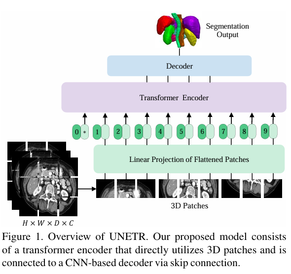
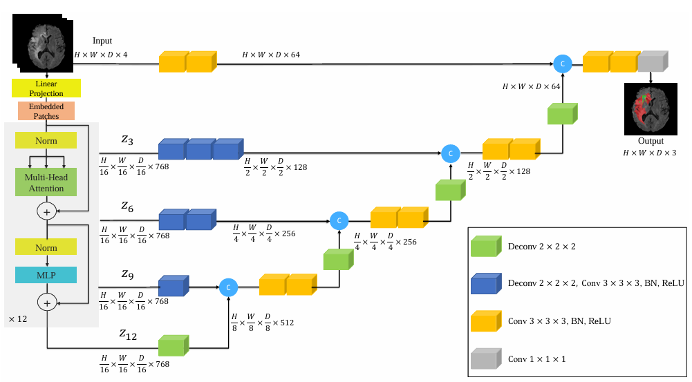
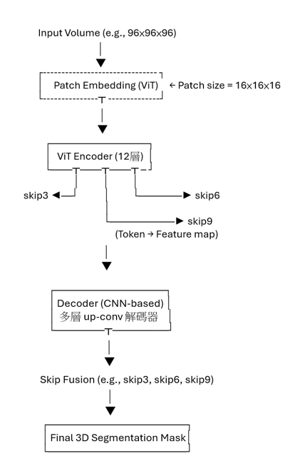
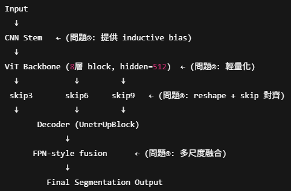

# DeepLearning-UNETR
113-2 IIM DeepLearning UNETR Framework Modification

針對 UNETR 模型進行研究與改良，應用於 3D 醫學影像分割任務。

## 📚 論文與原始碼連結

- 論文連結：https://arxiv.org/pdf/2103.10504
- 官方 GitHub：https://github.com/Project-MONAI/research-contributions/tree/main/UNETR/BTCV
- BTCV Dataset（精粹版）：https://www.synapse.org/Synapse:syn3193805/files/

## 🧠 模型介紹

UNETR (UNet with Transformers) 是一種結合 Vision Transformer（ViT）與 UNet 架構的 3D 醫學影像分割模型。

### 架構組成

- **ViT Encoder**：將輸入影像切成 patch，輸入 Transformer 提取語意特徵。
- **CNN Decoder**：負責重建 segmentation mask，結合 Transformer 與 encoder 的 skip features。
- **Skip Connection**：從 ViT 的第 3, 6, 9, 12 層擷取中間特徵，融合至 decoder。

## 📊 模型架構總覽

### 🧩 原始 UNETR 架構
> 使用純 ViT 編碼器搭配 CNN 解碼器的基本版本

### 🛠️ 改良後架構（本研究貢獻）
> 引入 CNN Stem、輕量 ViT、skip alignment 與 FPN-style 多尺度融合

### 特點

- 支援 3D patch-based encoding。
- 不需 external pretraining。
- 結合 global 表徵與 local 卷積處理。

## 🔧 實作細節

- **輸入維度**：96×96×96 (訓練時壓縮為 96×96×16)
- **Patch Size**：16×16×16
- **ViT 設定**：hidden size 768、12 layers、12 heads
- **訓練策略**：
  - Optimizer: AdamW (weight_decay=1e-5)
  - Learning rate: 1e-4
  - Epochs: 300
  - Batch size: 2
- **資料增強**：
  - RandFlipd, RandRotate90d, RandScaleIntensityd, RandShiftIntensityd
  - 採用 `RandCropByPosNegLabeld` 以強化前背景平衡

## 📊 參數調整實驗

| 增強策略      | Training Loss | Validation Accuracy |
|---------------|----------------|----------------------|
| Baseline      | 0.2736         | 0.9139               |
| Light_Aug     | 0.2682         | 0.9105               |
| Strong_Aug    | 0.2879         | 0.8995               |
| No_Intensity  | 0.2965         | 0.8911               |
| Flip_Only     | 0.2782         | 0.876                |

## 🏗️ 架構改良比較

| 改良版本         | Training Loss | Validation Accuracy |
|------------------|---------------|----------------------|
| 加入 CNN Encoder | 0.248         | 0.9215               |
| ViT 強化         | 0.255         | 0.9212               |
| Skip 對齊         | 0.287         | 0.9172               |
| FPN-style Fusion | 0.2814        | 0.9209               |
| **整合版**       | **0.2564**    | **0.9279**           |

## 📝 結論

- 適度資料增強能有效 regularize 模型，避免 overfitting。
- 改良架構結合 CNN 局部感知與 ViT 全域特徵學習，提升 segmentation 表現。
- 綜合調整可顯著提升 validation accuracy 至 0.9279。

> 本報告為課堂作業成果，僅供學術用途。
